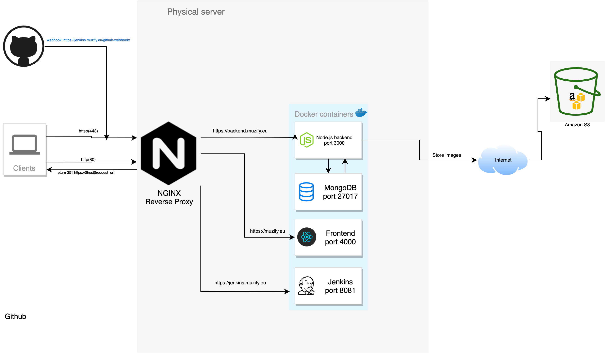

# Node.js Project

[](https://jenkins.muzify.eu/job/wallpaper-nodejs/)

Simple Node.js + GraphQL app in which user can discover & share beautiful images.
The backend is deployed at [backend.muzify.eu](https://backend.muzify.eu/graphql)
The fronent is deployed at is [muzify.eu](https://muzify.eu)([Github repo]())
 
### Run project
 - Install [docker](https://www.docker.com/)
 - Create `.env` file in project's root directory and paste in
    ```
    DB_URL=mongodb://mongo:27017
    SECRET=secret
    ```
    NOTE: DB_URL should be in Dockerfile? Maybe?
 - And hit `docker-compose up` in the project's root directory
 
### Tech
  - GraphQL
  - MongoDB
  - Node.js
 
### Features
- [x] Upload images
- [x] Like others images
- [x] View other profiles
- [x] Authenticate user
- [ ] Search images (TODO)
- [ ] Comment to images (TODO)
- [ ] Follow other users (TODO)
- [ ] Access control such as admin (TODO)
 
### Used service
  - This project uses [Amazon S3](https://aws.amazon.com/s3/) as a simple storage service for images.
 
### CI/CD
Regarding CI/CD a pipeline has been setup with [Jenkins](https://jenkins.muzify.eu)
Github Webhook: https://jenkins.muzify.eu/github-webhook/ (push)

Please checkout Jenkinsfile for the pipeline

### Unit testing & app structure
  - GraphQL Resolvers contain most of the logics and process requests therefore they need to be unit-tested carefully.
  - Dependencies which are injected to the resolvers: `authenticationController` and `imageService`.
  - Testing tools & libraries: 
    - [mocha](https://mochajs.org/)
    - [sinon](https://sinonjs.org/)
    - [mongodb-memory-server](https://www.chaijs.com/)
    - [istanbul](https://istanbul.js.org/)
    - [chai](https://www.chaijs.com/)
  - Why [mongodb-memory-server](https://www.chaijs.com/) instead of `Sinon.stub`?
    - no need to know which method the implementation code (mongoose model) uses
    - no need to write many lines of code for stubbing/mocking
### Docker
This project has been dockerized so it is easy to fireup on any machine running [docker](https://docker.com)

### Deployment @ muzify.eu
##### Architecture

##### Security
  -  Firewall is on
  ```
    thinh@ubuntuserver:~/wallpaper_backend$ sudo ufw status verbose
    Status: active
    Logging: on (low)
    Default: deny (incoming), allow (outgoing), deny (routed)
    New profiles: skip
    
    To                         Action      From
    --                         ------      ----
    443/tcp (Nginx HTTPS)      ALLOW IN    Anywhere                  
    80/tcp (Nginx HTTP)        ALLOW IN    Anywhere                  
    22/tcp (OpenSSH)           ALLOW IN    Anywhere                  
    443/tcp (Nginx HTTPS (v6)) ALLOW IN    Anywhere (v6)             
    80/tcp (Nginx HTTP (v6))   ALLOW IN    Anywhere (v6)             
    22/tcp (OpenSSH (v6))      ALLOW IN    Anywhere (v6)     
  ```
  - `npm audit`
  ```
  thinh@ubuntuserver:~/wallpaper_backend$ sudo npm audit
                                                                                
                       === npm audit security report ===                        
                                                                                
found 0 vulnerabilities
 in 1418 scanned packages
  ```

### Todos
  -  Search images
  - Comment to images
  - Follow other users
  - Access control such as admin
  - Integration tests
  - More unit tests for Post resolver
